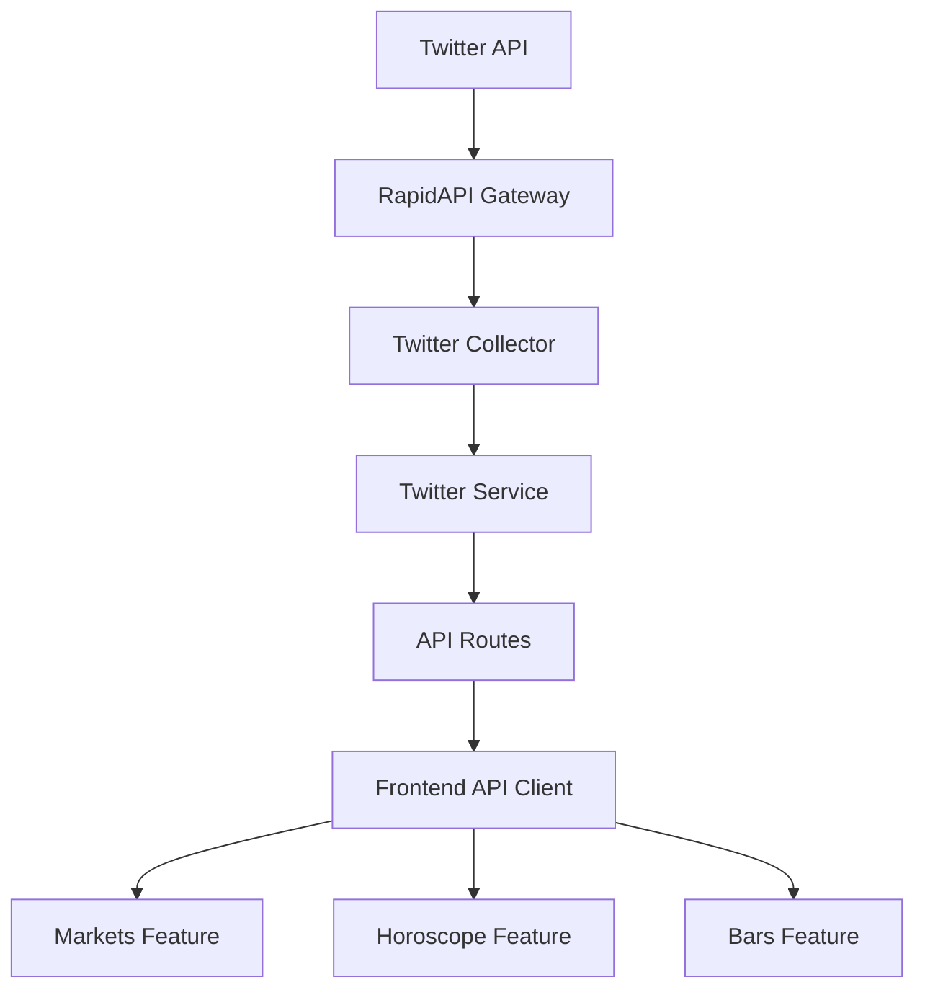
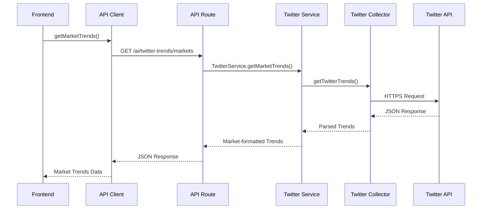
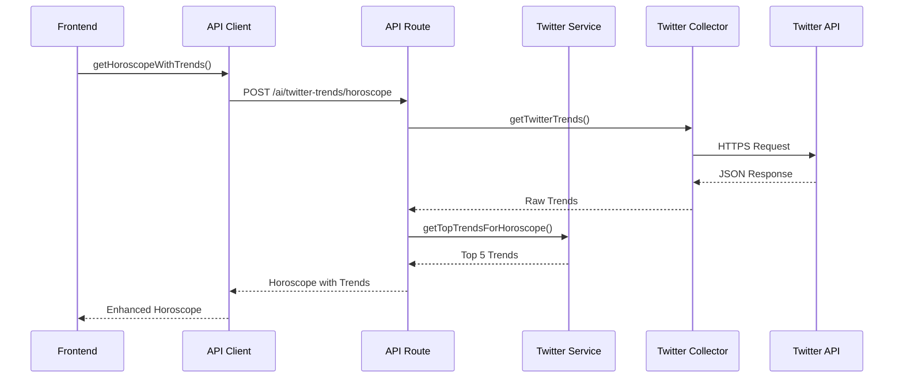
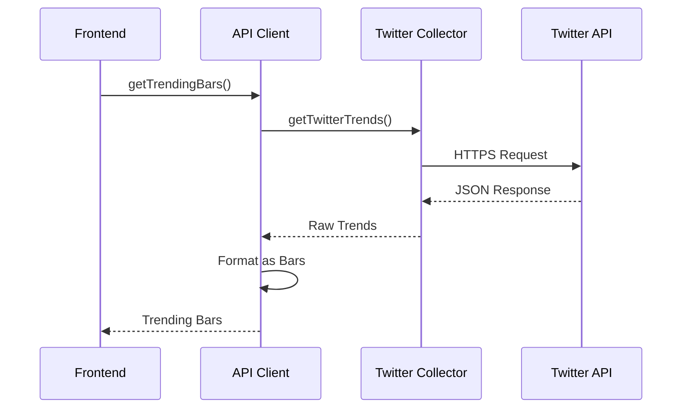

# Twitter Integration Architecture

## Overview
This document describes the architecture for integrating Twitter trends data into the StaticFruit application. The integration enhances three core features: Markets, Horoscope, and Bars, by providing real-time social media insights.

## System Architecture

### High-Level Diagram

### Component Descriptions

#### Twitter Collector
- **Location**: `staticfruit_kit/collectors/twitter_collector.ts`
- **Purpose**: Fetches raw Twitter trends data from RapidAPI
- **Technology**: Node.js https module
- **Security**: API key stored in environment variables

#### Twitter Service
- **Location**: `staticfruit_kit/services/twitter_service.ts`
- **Purpose**: Processes and transforms Twitter data for specific use cases
- **Functions**:
  - `getMarketTrends()` - Formats trends for market predictions
  - `getTopTrendsForHoroscope()` - Extracts relevant trends for horoscope input
  - `formatForBars()` - Converts trends to bar-style entries

#### API Routes
- **Location**: `staticfruit_kit/api/routes/twitter_trends.ts`
- **Purpose**: Exposes endpoints for frontend consumption
- **Endpoints**:
  - `GET /ai/twitter-trends` - Raw Twitter trends
  - `GET /ai/twitter-trends/markets` - Trends formatted for markets
  - `POST /ai/twitter-trends/horoscope` - Trends for horoscope input

#### Frontend API Client
- **Location**: `staticfruit_next_starter/lib/api.ts`
- **Purpose**: Provides typed functions for frontend components
- **Functions**:
  - `getTwitterTrends()` - Fetch raw trends
  - `getMarketTrends()` - Fetch trends for markets
  - `getHoroscopeWithTrends()` - Fetch horoscope with trend input

## Data Flow

### Markets Feature Integration

### Horoscope Feature Integration

### Bars Feature Integration

## Security Architecture

### API Key Management
- Keys stored in environment variables
- Never committed to version control
- Different keys for development/production environments

### Data Validation
- Input parameter validation
- Response sanitization
- Error handling for invalid data

### Rate Limiting
- Client-side caching (15-30 minute TTL)
- Server-side request queuing
- Monitoring of API usage quotas

## Performance Considerations

### Caching Strategy
- In-memory caching for frequently accessed data
- Cache warming for peak usage times
- Automatic cache invalidation

### Data Processing
- Selective field processing
- Pagination for large datasets
- Streaming for real-time updates

### Network Optimization
- Connection pooling
- Request compression
- Efficient data serialization

## Scalability

### Horizontal Scaling
- Stateless API routes
- Shared caching layer
- Load balancing support

### Vertical Scaling
- Database optimization
- Query optimization
- Resource allocation

## Monitoring and Observability

### Metrics Collection
- API response times
- Error rates
- Cache hit/miss ratios

### Logging
- Structured logging
- Error tracking
- Performance monitoring

### Alerting
- API downtime alerts
- Rate limit warnings
- Performance degradation alerts

## Deployment Architecture

### Development Environment
- Local API server
- Hot reloading
- Debug logging

### Production Environment
- Containerized deployment
- Load balancing
- SSL termination

### CI/CD Pipeline
- Automated testing
- Security scanning
- Deployment automation

## Future Enhancements

### Advanced Features
- Real-time trend updates
- Personalized trend recommendations
- Trend prediction algorithms

### Additional Data Sources
- Other social media platforms
- News sentiment analysis
- Cryptocurrency market trends

### Machine Learning Integration
- Trend classification
- Sentiment analysis
- Predictive modeling

## Conclusion

This architecture provides a robust foundation for integrating Twitter trends into the StaticFruit application. By following a collector-service-api-client pattern, we ensure separation of concerns, maintainability, and scalability. The implementation enhances user experience across multiple features while maintaining security and performance standards.