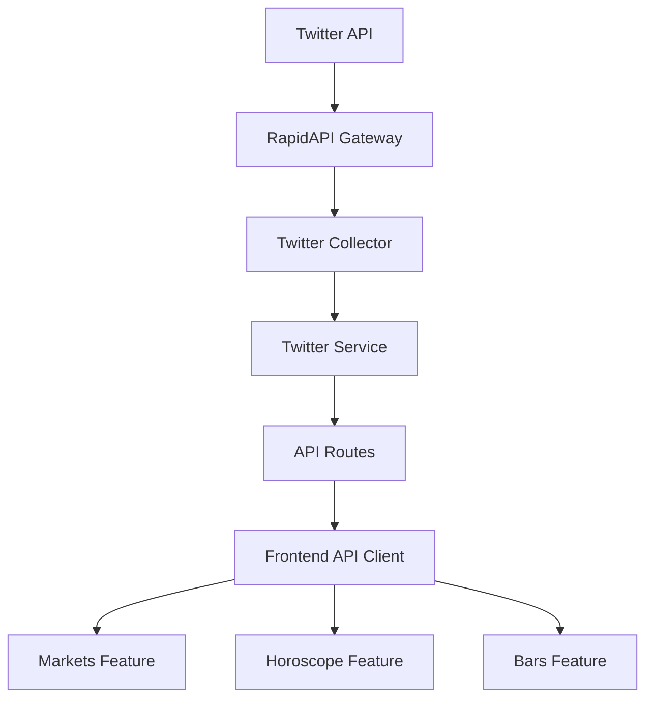

# Technical Specification: Twitter API Integration

## 1. Introduction

This document provides a detailed technical specification for integrating Twitter trends data into the StaticFruit application. The integration will leverage the X-RapidAPI service to fetch Twitter trends and incorporate them into three existing features: Markets, Horoscope, and Bars.

## 2. System Architecture

### 2.1 Overview
The integration follows a collector-service-api-client pattern:
- Collector: Fetches data from external Twitter API via RapidAPI
- Service: Processes and transforms data for specific use cases
- API: Exposes endpoints for frontend consumption
- Client: Consumes API endpoints in frontend components

### 2.2 Component Diagram



## 3. Implementation Details

### 3.1 Twitter Collector
File: `staticfruit_kit/collectors/twitter_collector.ts`

Responsible for fetching raw Twitter trends data from RapidAPI.

**Dependencies:**
- Node.js https module
- X_RAPIDAPI_KEY environment variable

**Functions:**
- `getTwitterTrends(locationId: string, count: number)`

**Response Format:**
```json
{
  "trends": [
    {
      "name": "string",
      "url": "string",
      "promoted_content": "string | null",
      "query": "string",
      "tweet_volume": "number | null"
    }
  ],
  "as_of": "string",
  "created_at": "string",
  "locations": [
    {
      "name": "string",
      "woeid": "number"
    }
  ]
}
```

### 3.2 Twitter Service
File: `staticfruit_kit/services/twitter_service.ts`

Processes raw Twitter data for specific use cases.

**Functions:**
- `transformForMarkets(trends: TwitterTrend[])`
- `getTopTrendsForHoroscope(trends: TwitterTrend[])`
- `formatForBars(trends: TwitterTrend[])`

### 3.3 API Routes
File: `staticfruit_kit/api/routes/twitter_trends.ts`

Exposes endpoints for frontend consumption.

**Endpoints:**
- `GET /ai/twitter-trends` - Raw Twitter trends
- `GET /ai/twitter-trends/markets` - Trends formatted for markets
- `POST /ai/twitter-trends/horoscope` - Trends for horoscope input

### 3.4 Frontend API Client
File: `staticfruit_next_starter/lib/api.ts`

Provides typed functions for frontend components.

**Functions:**
- `getTwitterTrends()`
- `getMarketTrends()`
- `getHoroscopeWithTrends(sign: string, date: string)`

## 4. Data Flow

### 4.1 Markets Feature Integration
1. Frontend calls `getMarketTrends()`
2. API client requests `/ai/twitter-trends/markets`
3. API route calls Twitter service
4. Twitter service transforms trends data
5. Response sent back to frontend
6. Markets component renders data

### 4.2 Horoscope Feature Integration
1. Frontend calls `getHoroscopeWithTrends()`
2. API client requests `/ai/twitter-trends/horoscope`
3. API route fetches current Twitter trends
4. Twitter service extracts top trends
5. Horoscope service incorporates trends into prediction
6. Response sent back to frontend

### 4.3 Bars Feature Integration
1. Frontend calls `getTrendingBars()`
2. API client requests Twitter trends data
3. Twitter service formats trends as bar entries
4. Response sent back to frontend
5. Bars component renders trend-based content

## 5. Environment Configuration

### 5.1 Required Variables
```
X_RAPIDAPI_KEY=a49f135d8cmsh547ccd0272a3b80p150b23jsn1623c6be959e
```

### 5.2 Configuration Files
- `staticfruit_kit/.env.template` - Template for API keys
- `staticfruit_next_starter/.env.local.example` - Template for frontend

## 6. Error Handling

### 6.1 API Failures
- Implement retry logic with exponential backoff
- Provide fallback data for critical features
- Log errors for monitoring and debugging

### 6.2 Rate Limiting
- Implement caching with appropriate TTL
- Monitor API usage quotas
- Queue requests during high-traffic periods

## 7. Security Considerations

### 7.1 API Key Protection
- Store keys in environment variables
- Never commit keys to version control
- Rotate keys periodically

### 7.2 Data Validation
- Validate all input parameters
- Sanitize API responses
- Implement request timeouts

## 8. Performance Optimization

### 8.1 Caching Strategy
- Cache Twitter trends for 15-30 minutes
- Use in-memory cache for frequently accessed data
- Implement cache warming for peak usage times

### 8.2 Data Processing
- Process only required data fields
- Implement pagination for large datasets
- Use streaming for real-time updates

## 9. Testing Plan

### 9.1 Unit Tests
- Twitter collector data fetching
- Data transformation functions
- API route handlers

### 9.2 Integration Tests
- End-to-end API workflows
- Frontend component data integration
- Error handling scenarios

### 9.3 Performance Tests
- API response times
- Concurrent request handling
- Cache effectiveness

## 10. Deployment Considerations

### 10.1 Environment Setup
- Ensure API keys are configured in all environments
- Verify network access to RapidAPI endpoints
- Monitor API usage and costs

### 10.2 Monitoring
- Track API response times and errors
- Monitor cache hit rates
- Alert on quota usage thresholds

## 11. Future Enhancements

### 11.1 Additional Data Sources
- Integrate other social media trends
- Add news sentiment analysis
- Include cryptocurrency market trends

### 11.2 Advanced Features
- Real-time trend updates
- Personalized trend recommendations
- Trend prediction algorithms